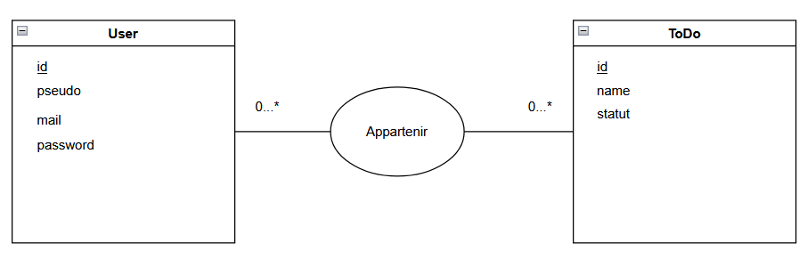
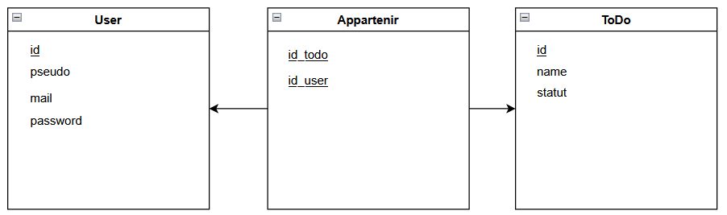

# Cahier des charges

## Fonctionnalités

- Page de connexion
- Authentification avec JWT
- Application CRUD pour des tâches
- Base de donnée pour enregistrer les tâches

## Diagramme modèle conception de donnée

## Diagramme modèle logique de donnée

